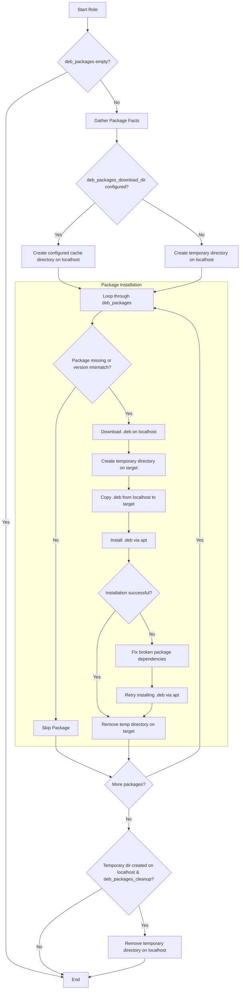

# Role: ansible-suite.deb_packages

- [Role: ansible-suite.deb\_packages](#role-ansible-suitedeb_packages)
  - [Example `requirements.yml` for Ansible site](#example-requirementsyml-for-ansible-site)
  - [Example defaults](#example-defaults)
  - [Example playbook](#example-playbook)
  - [Role workflow](#role-workflow)
  - [Role variables](#role-variables)
  - [Reference](#reference)

## Example `requirements.yml` for Ansible site

```yaml
roles:
  - name: ansible-suite.deb_packages
    src: git+https://github.com/ansible-suite/ansible-role-deb_packages.git
```

## Example defaults

```yaml
---
deb_packages:
  myapp:
    url: https://releases.example.com/myapp/myapp_2.5.0_amd64.deb
    checksum: sha256:a1b2c3d4e5f6789...
    version: '2.5.0'
  otherapp:
    url: https://downloads.example.com/otherapp_1.4.2_amd64.deb

# Use a persistent directory to reuse downloaded packages between playbook runs.
deb_packages_download_dir: /var/cache/ansible/deb_packages

# Set to true only when the automatically created temporary directory should be removed.
deb_packages_cleanup: false
```

## Example playbook

```yaml
---
- hosts: all
  become: true
  roles:
    - role: ansible-suite.deb_packages
      vars:
        deb_packages:
          example:
            url: https://example.com/example_1.0.0_amd64.deb
            checksum: sha256:a1b2c3d4e5f6789...
            version: '1.0.0'
        deb_packages_download_dir: /var/cache/ansible/deb_packages
        deb_packages_cleanup: false
```

The dictionary key must be the package name reported by `dpkg`. `url` points
to the `.deb` file, while `checksum` and `version` are optional. Packages are
downloaded once on the controller, copied to each target host, and installed
there. A package is installed only when it is missing or its requested
`version` differs from the installed version. If installation fails, the role
fixes broken dependencies and retries the installation.

## Role workflow



## Role variables

| Variable | Default | Description |
| --- | --- | --- |
| `deb_packages` | `{}` | Dictionary keyed by package name; values support `url`, optional `checksum`, and optional `version`. |
| `deb_packages_download_dir` | `''` | Directory on the controller used for downloaded packages. An empty value creates a temporary directory. |
| `deb_packages_cleanup` | `false` | Removes the automatically created controller temporary directory after installation. A configured download directory is never removed. |

Cache directory can be configured in `defaults/main.yml`:
```yaml
deb_packages_download_dir: /var/cache/ansible/deb_packages
```

## Reference

- [chaosmail: install-deb-packages-in-ansible](https://chaosmail.github.io/programming/2015/03/04/install-deb-packages-in-ansible/)
- [OneUptime: How to use Ansible to install packages from local .deb files](https://oneuptime.com/blog/post/2026-02-21-how-to-use-ansible-to-install-packages-from-local-deb-files/view)